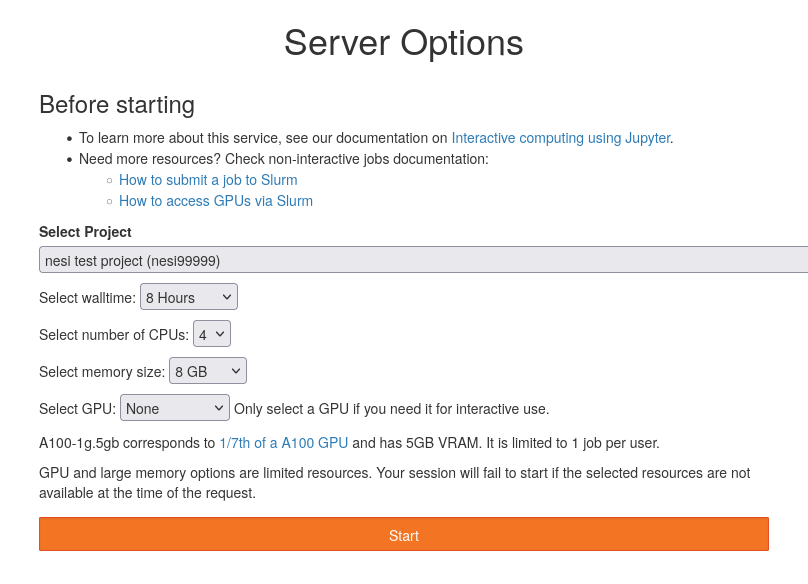

# ML102 - Image analysis

This is an online workshop that will use Jupyter on NeSI.
Attendees will be required to set up an account on NeSI in order to participate. 
Full instructions will be sent to registrants closer to the time of the workshop.


## Setup

At the beginning of the workshop, follow these instructions to start a session on Jupyter-on-NeSI:

1. Follow https://jupyter.nesi.org.nz/hub/login

2. Enter NeSI username, HPC password and 6 digit second factor token
   

3. Choose server options as below:

   - project code: nesi99991
   - walltime: 8 hours
   - number of CPUs: 4
   - memory size: 8 GB
   - GPU: **None** (we don't need any yet 😉)
   
   then press the **Start** button.
   

4. Let us know in zoom that you are ready to go (use 👍 reaction)

⚠️ If you don't manage to connect, let us know as soon as possible in the chat. ⚠️


## Workshop

This workshop consists of a series of notebooks, adapted from the [TensorFlow tutorials](https://www.tensorflow.org/tutorials):

1. [Introduction](notebooks/01_introduction.ipynb)
1. [Image classification](notebooks/02_classification.ipynb) ([source](https://www.tensorflow.org/tutorials/images/classification))
1. [Transfer learning and fine-tuning](notebooks/03_transfer_learning.ipynb) ([source](https://www.tensorflow.org/tutorials/images/transfer_learning))
1. [Slurm jobs on NeSI GPUs](notebooks/04_slurm_jobs.ipynb)

We have already made a copy of these notebooks for you in the folder:

```
/nesi/project/nesi99991/ml102_20220616/$USER
```

where `$USER` stands for your NeSI username.

We will now show you how to navigate in the Jupyter interface to find them.


## Supplemental material

We also created or adapted the following notebooks.
We won't use them during the workshop.

- [Convolutional Neural Network (CNN)](notebooks/cnn.ipynb) example ([source](https://www.tensorflow.org/tutorials/images/cnn))
- [Image Segmentation](notebooks/segmentation.ipynb) ([source](https://www.tensorflow.org/tutorials/images/segmentation))


## Appendix

- [Additional instructions to (re)set 2FA and login](https://dinindusenanayake.github.io/ganesi_authesetup-login/) (for helpers)
- [Generate a Jupyter kernel for the workshop](KERNEL.md) (for maintainers)
